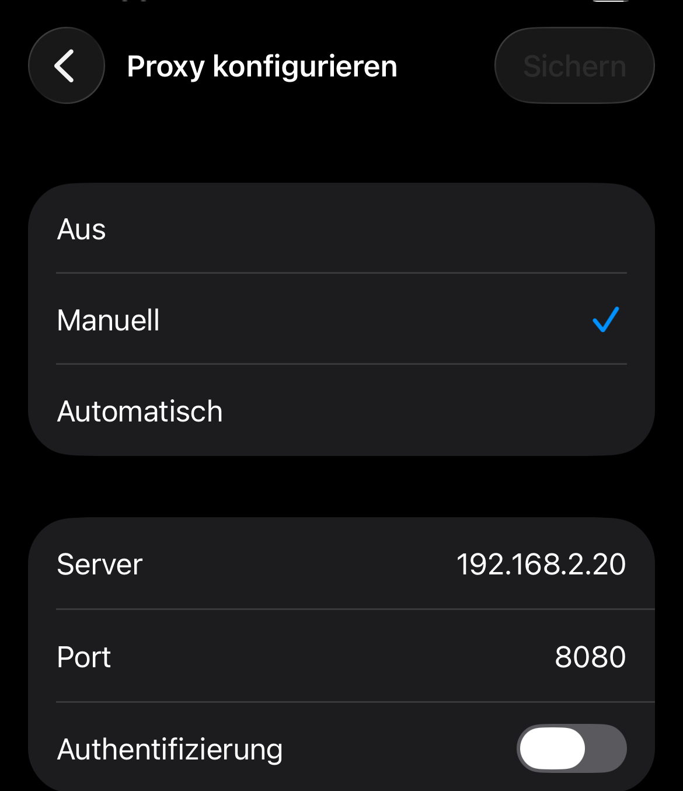
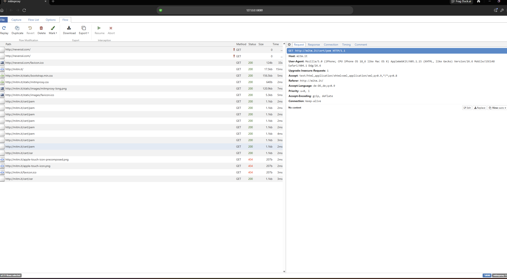
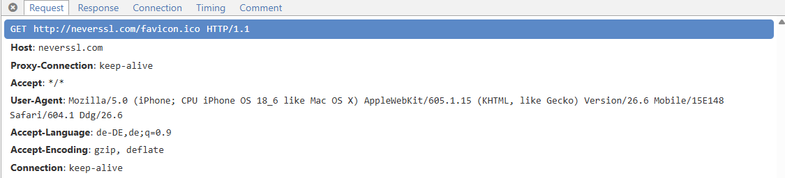
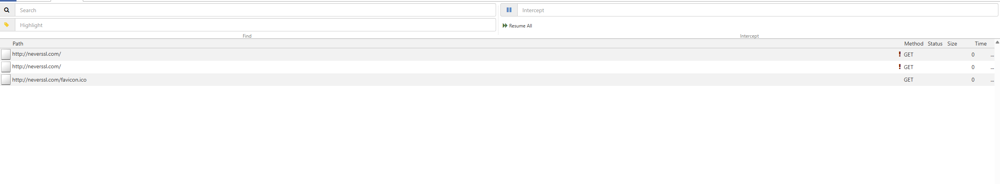
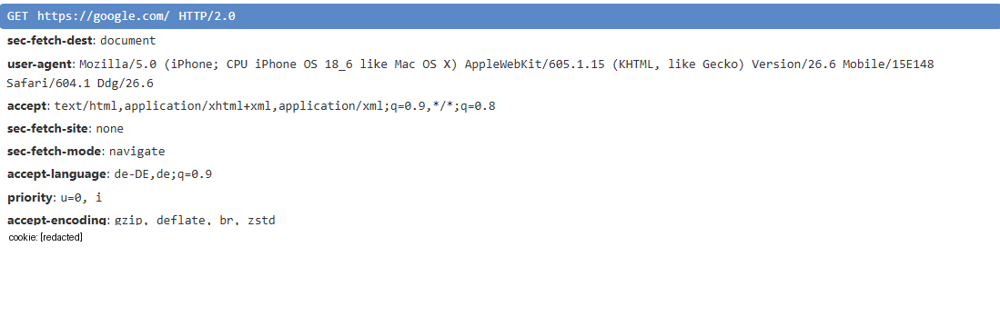

# iOS Traffic-Analyse mit mitmproxy

Eigenes Setup zum Verständnis, wie TLS/HTTPS-Verschlüsselung technisch funktioniert und welche unterschiedlichen Schutzmechanismen Apps dafür einsetzen.

## Setup

- mitmproxy installiert
- iPhone im WLAN auf manuellen Proxy gestellt (PC-IP, Port 8080)
- Root-Zertifikat über `mitm.it` installiert
- Zusätzlich unter Einstellungen → Allgemein → Info → Zertifikatsvertrauenseinstellungen aktiviert (ohne den Schritt bleibt HTTPS trotzdem unlesbar)

## Kontrast: unverschlüsselt vs. verschlüsselt

- Wireshark-Mitschnitt eines normalen QUIC/TLS-Pakets → nur Hex, nichts lesbar
- HTTP-Request an neverssl.com → Host, User-Agent, Sprache, alles im Klartext

## Mit aktivem MITM: HTTPS jetzt lesbar

- google.com Request vollständig sichtbar, Cookie-Werte im Screenshot geschwärzt

## Vergleich: unterschiedliche Schutzmechanismen bei Apps

Beim Ausprobieren mit ein paar installierten Apps fiel auf, dass nicht jede gleich reagiert:

| App | Beobachtung | Grund |
|---|---|---|
| WhatsApp | Verbindung sichtbar, Inhalt bleibt verborgen | Zusätzliche Ende-zu-Ende-Verschlüsselung auf App-Ebene |
| Trade Republic | Verbindung komplett verweigert | Certificate Pinning — App vertraut nur einem fest hinterlegten Zertifikat, nicht der allgemeinen Geräte-Vertrauensliste |
| PayPal | Login-Vorgang bricht mit Fehler ab | Ähnlicher Schutzmechanismus wie bei Trade Republic |

Das zeigt gut, wie unterschiedlich Apps mit demselben Grundproblem umgehen — manche verlassen sich auf die Geräte-Vertrauensliste, andere zusätzlich auf eigene, härtere Prüfungen.

## Kernerkenntnis

Interessant war vor allem, dass ein selbst installiertes Zertifikat nur greift, wenn die App der allgemeinen Geräte-Vertrauensliste vertraut. Apps mit Certificate Pinning oder zusätzlicher Ende-zu-Ende-Verschlüsselung lassen sich darüber gar nicht erst beeinflussen. Sicherheit ist damit nie eine einzelne Schicht, sondern immer das Zusammenspiel mehrerer unabhängiger Mechanismen (Transportverschlüsselung, App-eigene Zertifikatsprüfung, Verschlüsselung des Inhalts selbst).

## Reflexion

Ich habe dieses Projekt schrittweise mit KI-Unterstützung umgesetzt. Eine echte Risikoeinschätzung im Vorfeld hätte Wissen vorausgesetzt, das ich zu dem Zeitpunkt noch nicht hatte — das Verständnis dafür, was ein installiertes Root-Zertifikat technisch bedeutet, hat sich bei mir erst während und nach dem Projekt entwickelt, nicht vorher. Im Nachhinein würde ich den Eingriff als technisch überschaubar einordnen: reversibel, ohne Kernel-Zugriff, jederzeit rückgängig zu machen.

Diese Erfahrung hat mir mehr gebracht, als es vorher nur theoretisch nachzulesen — live zu sehen, wie unterschiedlich Apps auf denselben Eingriff reagieren, ist besser hängengeblieben als reine Theorie. Auffällig war z.B., dass alle getesteten Banking- und Krankenkassen-Apps (u.a. Trade Republic, PayPal, TKK) einen ähnlichen Schutzmechanismus (Certificate Pinning) zeigten — ein klares Muster, kein Einzelfall.

## Aufräumen danach

- mitmproxy beendet
- Proxy-Einstellung am iPhone zurückgesetzt
- Zertifikat entfernt (Vertrauenseinstellung + Profil gelöscht)

## Tools

- mitmproxy
- Wireshark

Hinweis: Test ausschließlich am eigenen Gerät im eigenen Netzwerk zu Lernzwecken.
