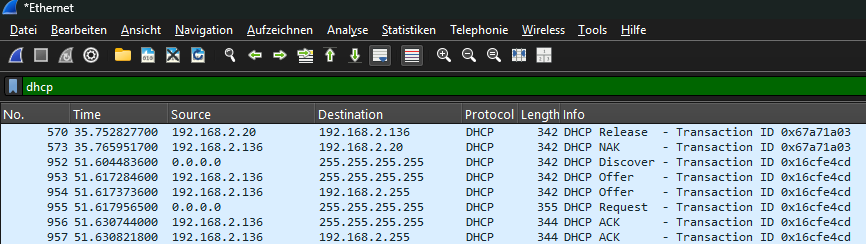
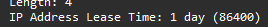
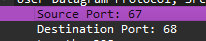
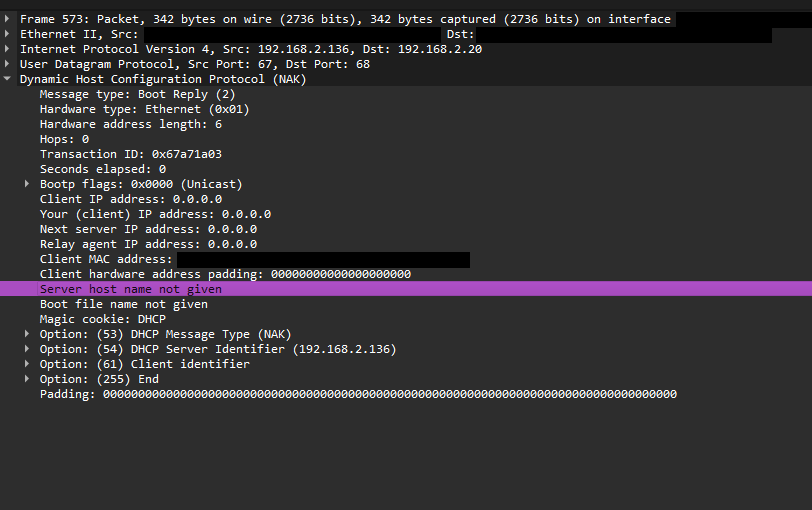

[README.md](https://github.com/user-attachments/files/33001829/README.md)
# DHCP im Heimnetz mitschneiden (Wireshark)

## Ziel

Den DHCP-Ablauf (Discover, Offer, Request, Acknowledge) im Heimnetz mit Wireshark mitschneiden und die einzelnen Pakete auswerten: Quelle und Ziel, Ports, Transaction ID, angebotene IP-Adresse und Lease-Zeit.

## Setup

- Tool: Wireshark, Interface: Ethernet
- Verkehr ausgelöst mit: `ipconfig /release` und `ipconfig /renew`
- Display Filter: `dhcp` (blendet nur aus, alle Pakete bleiben im Mitschnitt)

## Ablauf (DORA)

| Nr. | Typ | Quelle → Ziel | Ports (Src → Dst) | Anmerkung |
|-----|-----|---------------|-------------------|-----------|
| 952 | Discover | 0.0.0.0 → 255.255.255.255 | 68 → 67 * | Client hat noch keine IP und sucht per Broadcast einen Server |
| 953 | Offer | 192.168.2.136 → 255.255.255.255 | 67 → 68 * | Angebot des Servers |
| 954 | Offer | 192.168.2.136 → 192.168.2.255 | 67 → 68 * | zweites Offer, gleiche Transaction ID, Ziel ist der Subnetz-Broadcast |
| 955 | Request | 0.0.0.0 → 255.255.255.255 | 68 → 67 * | Client wählt ein Angebot, Broadcast, damit andere Server ihr Angebot zurückziehen |
| 956 | ACK | 192.168.2.136 → 255.255.255.255 | 67 → 68 * | Bestätigung, die Lease beginnt |
| 957 | ACK | 192.168.2.136 → 192.168.2.255 | 67 → 68 * | zweites ACK, gleiche Transaction ID, Ziel ist der Subnetz-Broadcast |

\* Die Ports folgen dem DHCP-Standard (Server 67, Client 68, UDP). Im Mitschnitt belegt ist 67 → 68 für ein Paket vom Server (siehe Ausschnitt unten).

Transaction ID der Pakete 952 bis 957: `0x16cfe4cd`.
Die gleiche Transaction ID zeigt, dass die sechs Pakete zu einem Ablauf gehören.

## Details aus den Paketen

| Was | Wert | Wo gefunden |
|-----|------|-------------|
| Angebotene IP-Adresse | `192.168.2.20` | Offer, Feld "Your (client) IP address" |
| Lease-Zeit | 1 Tag (86400 s) | Offer, Option "IP Address Lease Time" |
| IP des DHCP-Servers | `192.168.2.136` | Option "DHCP Server Identifier", zugleich Quell-IP der Server-Pakete |

Ausschnitt: Im Paket vom Server ist Source Port 67 und Destination Port 68.

## Auffälligkeiten

### Offer und ACK sind doppelt (Nr. 953/954 und 956/957)

Der Server antwortet auf Discover und Request jeweils zweimal. Alle vier Pakete kommen von derselben IP (192.168.2.136), es sind also nicht zwei Server. Sie unterscheiden sich nur im Ziel: 255.255.255.255 (Limited Broadcast) und 192.168.2.255 (Broadcast des Subnetzes). Warum der Server beide Varianten sendet, lässt sich aus dem Mitschnitt nicht ablesen.

### NAK (Nr. 573)

Davor steht bei Nr. 570 ein Release von 192.168.2.20 an den Server (Transaction ID `0x67a71a03`). Bei Nr. 573 antwortet der Server (192.168.2.136) mit einem NAK an 192.168.2.20, gleiche Transaction ID, Ports 67 → 68.

Im Paket stehen als Optionen nur Message Type (NAK), Server Identifier und Client Identifier. Eine Fehlermeldung als Text gibt es nicht, der Grund der Ablehnung ist also nicht ablesbar.

Ein NAK ist die Ablehnung durch den Server. Der Client muss dann mit einem neuen Discover von vorn beginnen. Ab Nr. 952 folgt ein vollständiger neuer DORA-Ablauf. Üblicherweise wird ein Release nicht beantwortet, warum hier ein NAK kommt, ist offen.

## Begriffe

- **Limited Broadcast (255.255.255.255):** Gilt nur im eigenen Netzsegment, Router leiten ihn nie weiter, und er braucht kein Wissen über das eigene Netz. Deshalb nutzt der Client ihn im Discover.
- **Directed Broadcast (192.168.2.255):** Bei der Maske 255.255.255.0 (/24) die Broadcast-Adresse des Netzes 192.168.2.0, sie erreicht alle Geräte dieses Netzes. Man muss dafür Netz und Maske kennen, ein Client ohne IP-Konfiguration kann sie im Discover nicht berechnen.
- **Quelle 0.0.0.0 im Discover:** Der Client hat noch keine IP-Adresse, 0.0.0.0 bedeutet "Absender noch unbekannt". Der Broadcast steckt im Ziel, nicht in der Quelle.
- **Lease:** Die Adresse ist nur für eine bestimmte Zeit geliehen, hier 1 Tag.
- **Reservierung:** Feste Zuordnung einer IP-Adresse zu einer MAC-Adresse, eingestellt im DHCP-Server und nicht befristet.

## Fazit

Der Mitschnitt zeigt einen vollständigen DORA-Ablauf mit gemeinsamer Transaction ID. Discover und Request gehen per Broadcast mit Quelle 0.0.0.0 raus, der Server antwortet mit Offer und ACK jeweils an zwei Broadcast-Adressen. Die Lease beträgt 1 Tag. Offen bleibt, warum der Server das Release mit einem NAK beantwortet und warum Offer und ACK doppelt gesendet werden.

## Hinweis zu den Screenshots

MAC-Adressen und die Interface-ID sind in den Screenshots geschwärzt.
